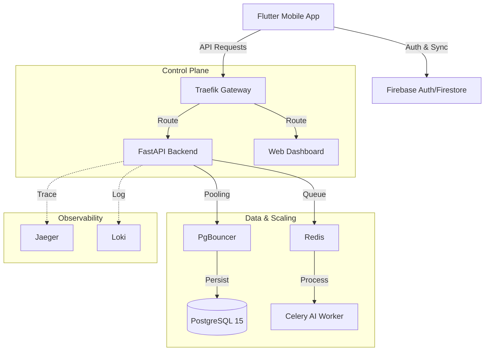

# ClassMate - AI-Powered Scalable Lecture Recorder

ClassMate is a production-grade mobile application and backend system for recording lectures, transcribing audio using AI, and generating intelligent notes. It features a **Hybrid Scalable Architecture** designed for 100k+ users.

## 🏗️ Architecture

The system uses a hybrid approach combining **Firebase** for identity/sync and a **Dockerized AI Backend** for heavy lifting.



### Key Technologies

- **Backend**: Python 3.13 (FastAPI), SQLAlchemy (Async), Celery
- **Database**: PostgreSQL 15 with PgBouncer (Connection Pooling)
- **Infrastructure**: Docker Compose, Traefik (Gateway), Redis
- **Observability**: OpenTelemetry, Jaeger, Loki, Grafana
- **Security**: Firebase Auth, Role-Based Access, Audit Logging

## 🚀 Getting Started

### Prerequisites

- Docker Desktop (Running)
- Flutter SDK (>=3.10.8)
- Firebase Project (configured)

### 1. Backend Setup (Docker)

The entire backend stack is containerized.

```bash
# 1. Clone repository
git clone <repository-url>
cd classmate

# 2. Add Firebase Credentials
# Place your firebase-service-account.json in ai_backend/

# 3. Start the Stack
docker-compose up -d --build
```

**Services:**

- **API Gateway**: `http://localhost:8080` (Traefik Dashboard)
- **Backend API**: `http://localhost:80/api/v1/public/health`
- **Observability**: `http://localhost:3001` (Grafana), `http://localhost:16686` (Jaeger)

### 2. Mobile App Setup

```bash
cd mobile_app
flutter pub get
flutter run
```

## 🔒 Security & Privacy

### Identity & Access

- **Hybrid Auth**: Firebase Authentication handles identity.
- **Identity Bridge**: Automatically syncs Firebase users to the internal PostgreSQL database.
- **Role-Based Access**: strict rules in `firestore.rules` and `storage.rules`.

### Data Integrity

- **Option 5:** Stop all servers.
- **Option 6:** View server logs (backend API and workers).
- **Option 7:** Run full health check.
- **Option 8:** Restart everything (one-click fix) and run the app.
- **Audit Logging**: All database mutations are tracked in `audit_logs`.
- **Soft Deletes**: Data is never permanently lost immediately (`deleted_at` support).
- **GDPR Compliance**: Automated workers available for data purging.

### Encryption

- **At Rest**: PostgreSQL data volume encryption recommended for prod.
- **In Transit**: All API traffic served via HTTPS (Traefik can handle Let's Encrypt).

## 🧪 Testing

### Automated Verification

Run the verification script to check stack health:

```bash
./scripts/verify_deployment.sh
```

### Manual Testing

1. **Auth**: Login via Flutter app -> Check `users` table in Postgres.
2. **Transcription**: Record audio -> detailed logs in Grafana -> Transcript appears in DB.
3. **Load**: `docker-compose up --scale worker=3` to test horizontal scaling.

## 🤝 Contributing

1. Fork the repo
2. Create feature branch (`git checkout -b feature/amazing-feature`)
3. Commit changes (`git commit -m 'Add amazing feature'`)
4. Push to branch (`git push origin feature/amazing-feature`)
5. Open a Pull Request

## 📄 License

MIT License
